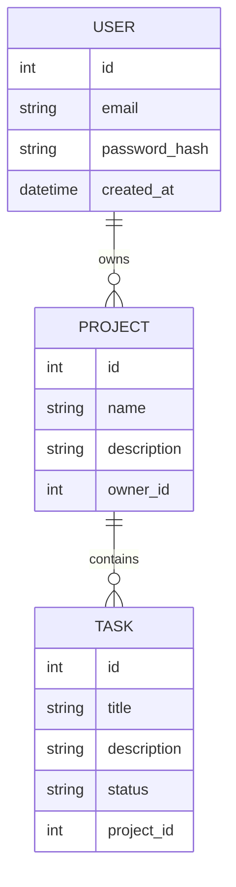
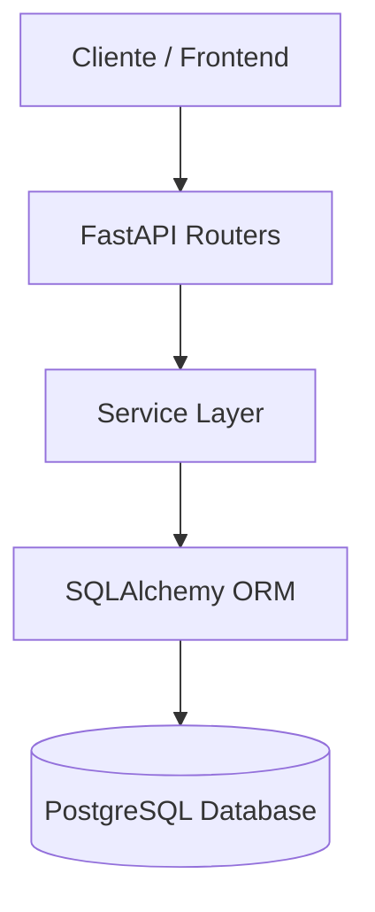

# Project Management API


API REST para la gestión de proyectos y tareas.

Este proyecto fue desarrollado como parte de mi **portfolio de backend** para demostrar conocimientos de arquitectura backend moderna utilizando **Python, FastAPI y PostgreSQL**.

---

# Stack Tecnológico

* Python
* FastAPI
* PostgreSQL
* SQLAlchemy (ORM)
* Alembic (migraciones de base de datos)
* Pydantic (validación de datos)
* Passlib + bcrypt (hash seguro de contraseñas)
* JWT (autenticación)
* Docker
* Docker Compose

---

# Arquitectura del Dominio

El sistema sigue el siguiente modelo de datos:

User  
 └── Projects  
      └── Tasks  

Cada usuario puede tener múltiples proyectos, y cada proyecto puede contener múltiples tareas.

---

# Arquitectura de Base de Datos (ERD)

El sistema utiliza un modelo relacional con tres entidades principales:

- User
- Project
- Task

Relaciones:

- Un **User** puede tener múltiples **Projects**
- Un **Project** puede tener múltiples **Tasks**

Diagrama de entidades:



---

# Arquitectura del Sistema

El backend sigue una arquitectura por capas separando responsabilidades.

Flujo de una request:

Cliente  
↓  
FastAPI Router  
↓  
Service Layer (lógica de negocio)  
↓  
SQLAlchemy ORM  
↓  
PostgreSQL  

Diagrama de arquitectura:



Este flujo representa cómo viajan las requests dentro del backend.

---

# Endpoints de la API

| Método | Endpoint | Descripción |
|------|------|------|
| POST | /auth/register | Registrar usuario |
| POST | /auth/login | Login y generación de JWT |
| GET | /users/me | Obtener usuario autenticado |
| POST | /projects | Crear proyecto |
| GET | /projects | Listar proyectos |
| GET | /projects/{id} | Obtener proyecto |
| PUT | /projects/{id} | Actualizar proyecto |
| DELETE | /projects/{id} | Eliminar proyecto |
| POST | /tasks | Crear tarea |
| PUT | /tasks/{id} | Actualizar tarea |
| DELETE | /tasks/{id} | Eliminar tarea |

---

# Documentación de la API

FastAPI genera documentación automática utilizando **Swagger UI**.

Una vez que la API está corriendo se puede acceder en:

```
http://localhost:8000/docs
```

Swagger permite:

* explorar los endpoints
* probar requests directamente desde el navegador
* ver los modelos de request y response
* autenticar utilizando JWT

Esto facilita el testing de la API y el desarrollo de clientes que consumen el backend.

---

# Funcionalidades Implementadas

## Autenticación de Usuarios

### Registro de usuario

Endpoint:

POST /auth/register

Permite crear un nuevo usuario con:

* validación de email
* hash seguro de contraseña
* protección contra emails duplicados

Ejemplo de request:

```json
{
  "email": "usuario@example.com",
  "password": "123456"
}
```

---

### Login de usuario

Endpoint:

POST /auth/login

Flujo del login:

email + password  
↓  
buscar usuario en la base de datos  
↓  
verificar contraseña con bcrypt  
↓  
generar JWT  
↓  
devolver access_token  

Respuesta esperada:

```json
{
  "access_token": "eyJhbGc...",
  "token_type": "bearer"
}
```

---

### Obtener usuario autenticado

Endpoint:

GET /users/me

Este endpoint requiere un **JWT válido**.

El token se envía en el header:

```
Authorization: Bearer <token>
```

Permite identificar al usuario autenticado.

Ejemplo de respuesta:

```json
{
  "id": 1,
  "email": "usuario@example.com",
  "created_at": "2026-03-09T20:00:00"
}
```

---

# Gestión de Proyectos

Cada usuario puede crear y gestionar sus propios proyectos.

Endpoints disponibles:

POST /projects  
GET /projects  
GET /projects/{id}  
PUT /projects/{id}  
DELETE /projects/{id}

Características:

* Los proyectos están asociados al usuario autenticado
* Un usuario solo puede acceder a sus propios proyectos
* Protección mediante JWT

Ejemplo de creación de proyecto:

```json
{
  "name": "API Portfolio",
  "description": "Proyecto de práctica con FastAPI"
}
```

---

# Gestión de Tareas

Cada proyecto puede contener múltiples tareas.

Endpoints disponibles:

POST /tasks  
PUT /tasks/{id}  
DELETE /tasks/{id}

Cada tarea contiene:

* title
* description
* status
* project_id

Estados posibles de una tarea:

```
pending
in_progress
done
```

Ejemplo de creación de tarea:

```json
{
  "title": "Implementar autenticación",
  "description": "Agregar login con JWT",
  "status": "pending",
  "project_id": 1
}
```

---

# Arquitectura del Proyecto

El proyecto sigue una arquitectura modular separando responsabilidades.

```
app
 ├ api
 │   ├ dependencies
 │   │   └ auth.py
 │   │
 │   └ v1
 │       ├ auth.py
 │       ├ users.py
 │       ├ projects.py
 │       └ tasks.py
 │
 ├ core
 │   ├ config.py
 │   └ security.py
 │
 ├ db
 │   ├ database.py
 │   └ session.py
 │
 ├ models
 │   ├ user.py
 │   ├ project.py
 │   └ task.py
 │
 ├ schemas
 │   ├ user.py
 │   ├ project.py
 │   ├ task.py
 │   └ token.py
 │
 └ services
     ├ user_service.py
     ├ auth_service.py
     ├ project_service.py
     └ task_service.py
```

Descripción de cada capa:

**api**  
Define los endpoints HTTP.

**dependencies**  
Contiene dependencias reutilizables como autenticación JWT.

**schemas**  
Validación y serialización de datos con Pydantic.

**services**  
Contiene la lógica de negocio del sistema.

**models**  
Define los modelos de base de datos usando SQLAlchemy.

**db**  
Configura la conexión a PostgreSQL.

**core**  
Contiene utilidades del sistema como seguridad y configuración.

---

# Cómo ejecutar el proyecto

## Opción 1 — Usando Docker (Recomendado)

Clonar el repositorio:

```bash
git clone https://github.com/Nahuellunacab/project-management-api
```

Entrar al proyecto:

```bash
cd project-management-api
```

Levantar contenedores:

```bash
docker compose up --build
```

Ejecutar migraciones de base de datos:

```bash
docker compose exec api alembic upgrade head
```

Abrir la documentación automática:

```
http://localhost:8000/docs
```

---

## Opción 2 — Desarrollo local sin Docker

Crear entorno virtual:

```bash
python -m venv venv
```

Activar entorno virtual:

Windows:

```bash
venv\Scripts\activate
```

Instalar dependencias:

```bash
pip install -r requirements.txt
```

Ejecutar la API:

```bash
uvicorn app.main:app --reload
```

Abrir la documentación:

```
http://127.0.0.1:8000/docs
```

---

# Base de Datos

El proyecto utiliza **PostgreSQL** como base de datos.

Las migraciones se gestionan con **Alembic**, lo que permite versionar cambios en el esquema de la base de datos.

Generar migración:

```bash
alembic revision --autogenerate -m "nueva migracion"
```

Aplicar migraciones:

```bash
alembic upgrade head
```

---

# Versión

Versión actual:

**v1.1.0**

Incluye:

* backend completo con FastAPI
* autenticación JWT
* CRUD de proyectos
* CRUD de tareas
* autorización por usuario
* arquitectura backend por capas
* dockerización del backend
* PostgreSQL en contenedor
* migraciones ejecutadas dentro de Docker
* mejoras en documentación

---

# Changelog

## v1.1.0

* Dockerización del backend
* Docker Compose con PostgreSQL
* ejecución de migraciones Alembic dentro del contenedor
* mejoras en documentación del README
* agregado diagrama de arquitectura del sistema

## v1.0.0

Primera versión funcional del sistema con:

* autenticación JWT
* gestión de usuarios
* CRUD de proyectos
* CRUD de tareas
* autorización por usuario
* arquitectura backend por capas

---

# Roadmap del Proyecto

Próximas funcionalidades planificadas:

* Endpoint `GET /projects/{id}/tasks`
* Filtros y paginación
* Tests automáticos con pytest
* CI/CD con GitHub Actions
* Frontend para consumir la API (React)